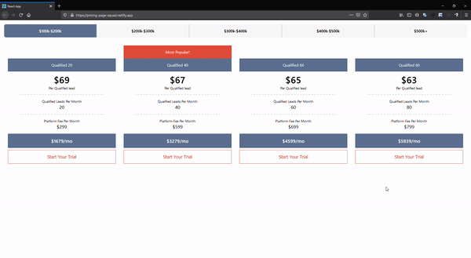
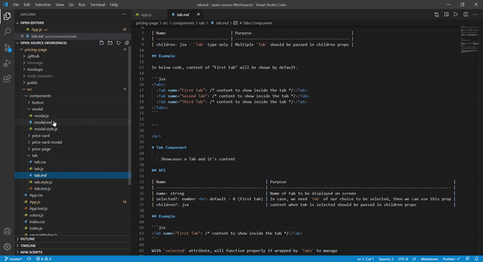

# Pricing page

This page shows pricing in different range and has form to accept "Start trial" for selected price.

## Demo

URL - https://pricing-page-squad.netlify.app/

(Click on below gif's to see full video)

#### Application Demo

#### Project folder structure

## Installation

Pre-requisite: Either have  or  installed in your machine globally

After cloning the repository, follow the following steps to run application -

- Install all dependencies - Run `yarn install` || `npm install` in cmd in project directory
- Then, start the application with command - `yarn start` || `npm start`
